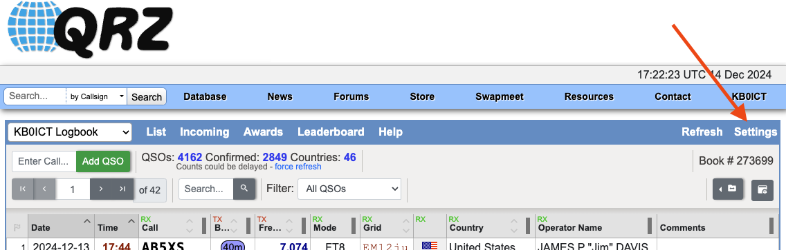
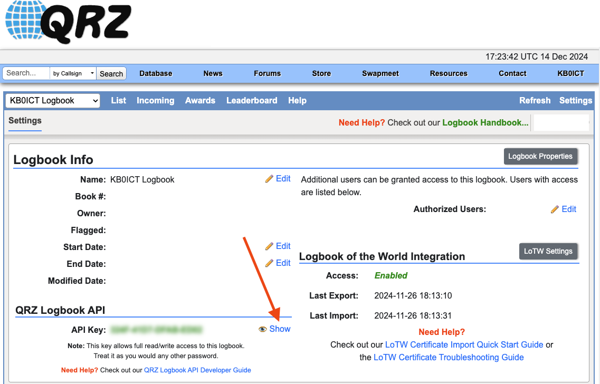
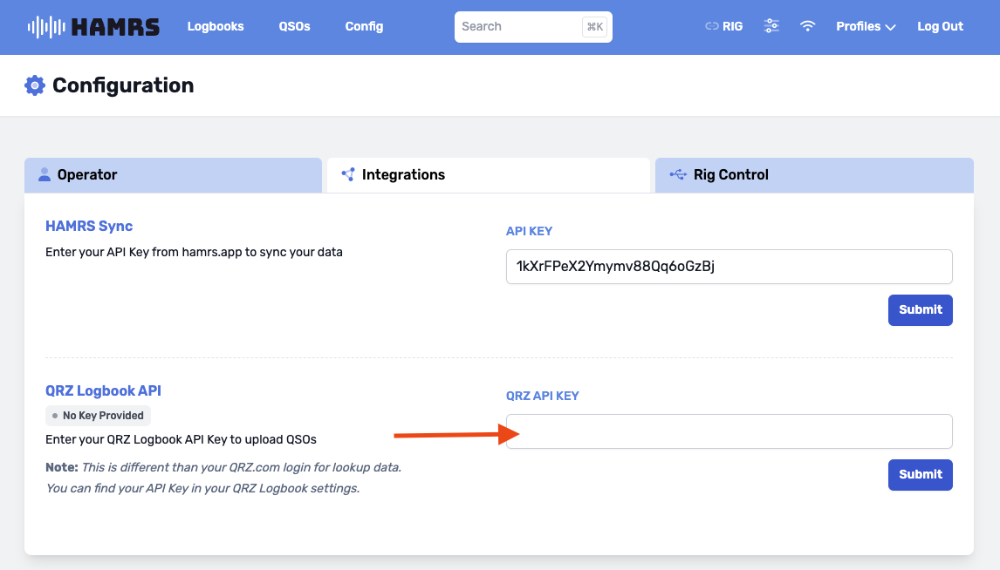

# Configuration
:::info

**Paid QRZ.com XML subscribers** can connect HAMRS to QRZ via their API Key. 

:::

## Finding your API Key on QRZ.com

### 1. Navigate to your Logbook Settings:

### 2. Click 'Show' to un-hide your API key:

### 3. Enter your API Key in HAMRS Config > Integrations:

