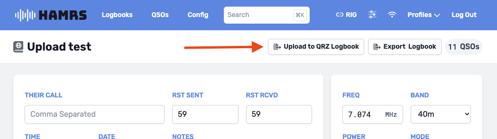
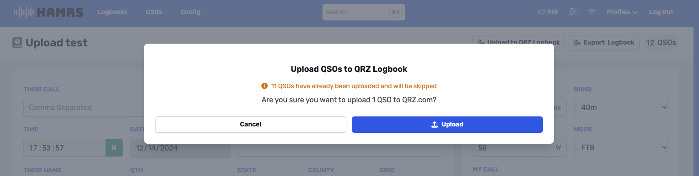
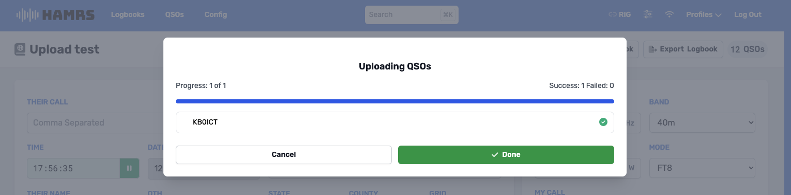

# Uploading Logbooks to QRZ

:::note
Make sure you have [set up your QRZ API Key](configuring-api-key)
:::
:::info
**Paid** QRZ.com XML Subscription feature
:::

### 1. Navigate to a logbook

### 2. Click the Upload to QRZ Logbook Button

### 3. Confirm data to be uploaded
:::note
QSOs that have been uploaded previously will not be included
:::

### 4. Verify upload status

* **Successful Uploads:** Will have a green checkmark next to them
* **Errored Uploads:** Will display the error received from QRZ. You can edit these QSOs to fix errors, and export the logbook again. 